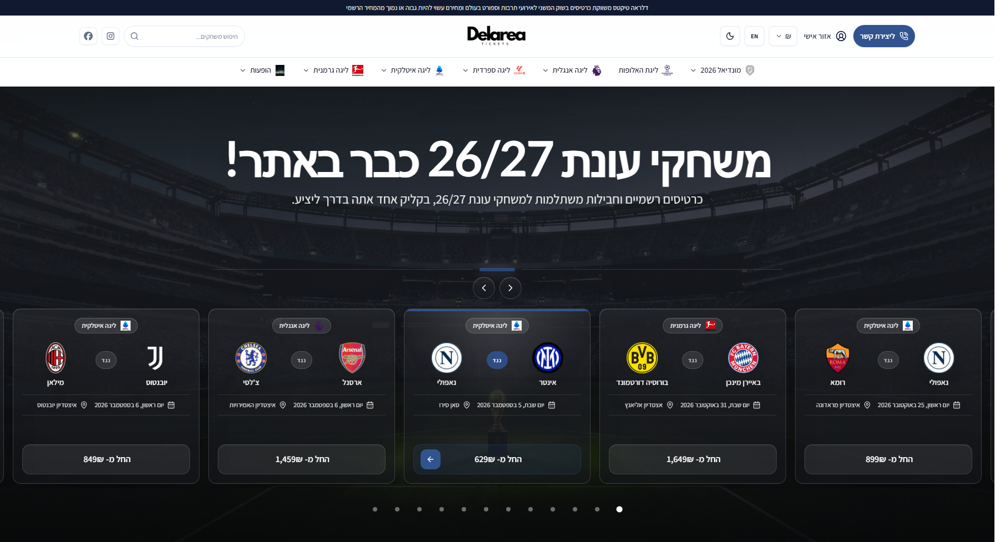
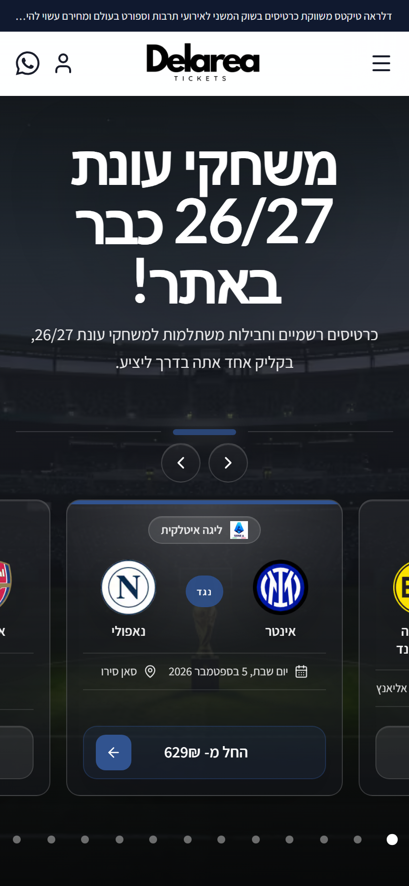

<div align="center">
  <h1>DelareaTickets</h1>
  <p><strong>Football Tickets & Travel Packages — E-commerce Platform</strong></p>
  <p>A production Next.js 16 e-commerce platform built and shipped end-to-end for a football ticket and travel-package vendor. Hebrew-first RTL, bilingual (he/en), hosted-page payments, a WhatsApp CRM with automated customer journeys, and a commissioned sales-agent network. Deployed on Vercel.</p>

  <p>
    <a href="https://delareatickets.com/he" target="_blank">
      
    </a>
  </p>

  <br/>

  
  
  
  
  
  
  
  
  
</div>

---

## Preview

<div align="center">
  <table>
    <tr>
      <td align="center" valign="top">
        
        <br/><sub><b>Desktop · Hebrew RTL</b></sub>
      </td>
      <td align="center" valign="top">
        
        <br/><sub><b>Mobile · Hebrew RTL</b></sub>
      </td>
    </tr>
  </table>
</div>

---

## About

**DelareaTickets** is a production e-commerce platform for selling football match tickets and travel packages, built end-to-end as the sole engineer. The codebase itself is private — this README is the portfolio-facing summary covering the architecture, engineering decisions, and screenshots that I can share publicly.

---

## Highlights

- **100+ pages** rendered: 4 marketing route groups, 75 admin views across ~25 sections, dashboard + auth flows
- **Bilingual RTL** — Hebrew-first with English fallback, cookie-driven locale, DB-backed CMS with entity-level fallback chain
- **WhatsApp CRM** — live inbox over Supabase Realtime, journey-based automations with quiet-hours scheduling, broadcasts with preflight quota checks, and opt-out enforcement (STOP/START keywords) on every send path
- **Sales-agent network** — personal agent links with attribution, percentage / fixed / hybrid commission rules, a commission ledger, and manual payout batches
- **Hand-written SQL migrations** (190+ numbered files) — no Drizzle Kit codegen, full control over indexes, RLS, partial-index strategy
- **`pg_trgm` GIN indexes** powering admin ILIKE search across users, teams, events, orders, leagues
- **Single-region deployment** — Node functions co-located with the database, RTT-aware, no over-engineered edge routing
- **Lighthouse-tuned** — Partial Pre-Rendering on marketing routes, `cacheComponents: true` on Next.js 16, dynamic imports below the fold
- **Zero-downtime legacy import** — historical orders from a prior CMS merged into admin views with HMAC-token unsubscribe links

---

## Tech Stack

| Layer            | Choice                                                                       |
| :--------------- | :--------------------------------------------------------------------------- |
| **Framework**    | Next.js 16 (App Router) + React 19 + TypeScript strict                       |
| **Styling**      | Tailwind CSS v4 + shadcn/ui + `motion/react`                                 |
| **Database**     | Supabase Postgres + Drizzle ORM (types only) + hand-written SQL migrations   |
| **Auth**         | Supabase Auth (email + Google OAuth) + Row-Level Security                    |
| **Payments**     | Hosted-page redirect + IPN webhook verification                              |
| **External**     | Football fixtures API · WhatsApp messaging API · invoicing provider API      |
| **Hosting**      | Vercel                                                                       |
| **Monitoring**   | Sentry + GA4 + transactional email webhooks                                  |
| **Tests**        | Vitest                                                                       |
| **Money**        | `decimal.js`, never native floats                                            |

---

## Architecture

```
                ┌──────────────────────────────────────────────┐
                │                   Vercel                     │
                │  Next.js 16 · App Router · Edge + Node fns   │
                │                                              │
     client ──► │  (marketing) public pages (PPR)              │
                │  (auth)      login / OAuth callback          │
                │  (dashboard) user + admin (RSC + RCC)        │
                │  /api/*      route handlers (Node)           │
                │  /api/cron/* scheduled                       │
                └──────┬─────────────────┬──────────────────┬──┘
                       │                 │                  │
                       ▼                 ▼                  ▼
             Supabase Postgres      Hosted payment     Football fixtures
             (pgBouncer 6543)       provider           API
                       │
                       ▼
                Supabase Auth · Supabase Storage
```

External services: error monitoring + source maps, transactional and marketing email, rate limiting, WhatsApp messaging provider, invoicing provider, optional outbound automation.

---

## Major Systems

### Bilingual RTL i18n
Hebrew-first with English fallback, cookie-driven locale, generated content fallback chain across DB-backed CMS. All Radix primitives receive `dir={direction}`; logical Tailwind props (`ms-`/`me-`/`ps-`/`pe-`) only — never directional.

### Football Fixture Sync
Hybrid model: tournament leagues get a 365-day full sync with auto-activation; domestic leagues update existing fixtures by ID and queue new ones for admin approval. Per-league failures isolated via `Promise.allSettled`. One 429 retry honouring `Retry-After`. Postgres advisory locks prevent concurrent runs from clobbering each other. Each run writes a row to a `sync_history` table for the admin dashboard.

### Payments
Hosted-page redirect flow with independent webhook verification — the IPN handler round-trips a verification API call rather than trusting any payload signature. The payment flow marks the order paid/authorized and records coupon usage transactionally. The app intentionally does not keep hard ticket-category stock counters; availability is handled operationally before fulfilment/approval. 25 s HTTP timeout matches the database `statement_timeout` so a stuck provider can never hang the request.

### Pricing Engine
Rule-based engine with bounded-concurrency refresh and advisory-lock serialization. Stale data falls back to a static formula so checkout never blocks.

### Coupon Engine
Percentage and fixed-amount discounts, scoped (global / league / event), with min-order amount and max-uses enforcement. Validated server-side and recorded transactionally during payment confirmation.

### Add-on Engine
Per-event configuration of flights / hotels / cancellation / custom add-ons. Drives the interactive purchase flow with stadium seat maps, persists selections in a separate `order_addon_selections` table, and powers admin-side bulk seeding.

### WhatsApp CRM & Automations
Full messaging layer over a WhatsApp provider API: a live admin inbox (chat list, conversation pane, composer) streaming over Supabase Realtime, media attachments, and per-order message timelines. Journey-based automations send scheduled messages around each customer's trip; broadcasts run preflight quota checks before dispatch. Compliance is enforced at the send path, not the UI: every outbound route checks opt-out state, STOP/START/HELP keywords are auto-handled, marketing messages carry the legally required footer, and scheduled automation reminders are clamped to a quiet-hours window. Delivery-status tracking feeds per-automation analytics, and WhatsApp message history is redacted on GDPR user deletion.

### Sales Agents
Commissioned-agent module: each agent gets a personal link (with slug aliases) whose clicks and orders are attributed to them. Commission rules support percentage / fixed / hybrid models, accrue into a ledger, and settle through manual payout batches. Agents get their own dashboard; admins get per-agent analytics built on dedicated event + daily-rollup tables.

### Invoicing
Tax documents are issued from the admin panel through an Israeli invoicing provider's API, linked to orders in a dedicated `order_documents` table, with configurable delivery to the customer.

### Admin Panel
75 pages across ~25 sections — catalog (4-level hierarchy: leagues → teams → events → ticket categories), add-ons editor, pricing rules (+ pending market-price review), stadium maps, leagues / teams toggles, orders (incl. manual multi-line orders) + customers, coupons, agents, CMS (homepage / navigation / trust badges / legal pages), FAQs / testimonials / contact, inquiries inbox, marketing emails + popups, WhatsApp inbox + broadcasts, automations, analytics, integrations (football sync, market pricing, currency), audit log, on-demand DB backups. Permission keys with assertion at every server action; owners bypass.

### CMS
Database-backed (`cms_content`) with bilingual fields and entity-level fallback chain. Three admin pages cover homepage, navigation/footer, and trust badges. Public CMS assets served from Supabase Storage.

### Auth
Supabase Auth (email + Google OAuth). Middleware gates dashboard and settings routes. Row-Level Security policies applied to 36 tables as a second line of defence even for admin-only data.

---

## Engineering Decisions Worth Highlighting

### Partial Pre-Rendering on marketing routes
Static shell streams instantly, dynamic data hydrates afterwards. Combined with Next.js 16's `cacheComponents: true` and a cardinality-aware `'use cache'` policy: cached only when distinct argument combinations are bounded, the underlying query is hot, and a clear `cacheTag` owner exists that mutations already bust.

### pgBouncer transaction-pool with `prepare: false`
Port 6543. Pool tuned per environment (build = 2, dev = 10, prod = 8). Aggregate results coerced through `Number()` because pgBouncer can return strings; `count(table.id)` over bare `count()` to dodge a known pgBouncer gotcha.

### `pg_trgm` GIN indexes for admin search
Fast ILIKE search across admin tables — users by email + name, teams by name, events by venue, orders by `id::text`, legacy orders by customer email/name/event.

### Consolidated SQL over `Promise.all`
Admin pages with related counts/aggregates use one query with `LEFT JOIN` sub-selects rather than fanning out parallel `db.select()`s — keeps the connection pool from saturating under cold-lambda + EU RTT.

### Postgres advisory locks
Serialize cron runs (one for the football sync, one for the pricing pipeline, plus per-event locks for granular work). Dual-lock pattern on per-event re-fetches.

### Manual `Sentry.startSpan({ op: 'db.query' })`
Wrappers on heavy uncached fetchers, because `@sentry/nextjs` does not auto-instrument `postgres-js` (porsager/postgres). Without these, Drizzle queries don't appear as DB spans in traces.

### Shared transient-network-error classification
Every outbound HTTP client (WhatsApp provider, FX rates, invoicing) judges connection blips through one `isTransientNetworkError` helper — undici error codes on the `cause` of a `fetch failed` `TypeError` — so an upstream hiccup is retried/downgraded consistently instead of paging Sentry as an unclassified `TypeError`, while genuine programming errors are never mislabelled as transient.

### Consent enforced at the send path, not the UI
WhatsApp opt-out state is checked inside every outbound send route (automations, broadcasts, manual inbox sends), with STOP/START/HELP keyword auto-replies handled at the webhook — disabling a button in the admin UI is never the compliance boundary.

---

## Performance & Reliability

- `decimal.js` for all financial math; `numeric(10,2)` columns in Postgres
- `Promise.allSettled` per failure-domain (per-league sync, per-rate FX refresh) so one upstream error never poisons the batch
- Per-route `tracesSampler` in Sentry — high sample rates on payments + sync, low on hot marketing routes
- `safeFetch(promise, op, fallback, 25_000)` helper that timeboxes admin data fetches with breadcrumb-tagged Sentry capture and a typed fallback
- `connect_timeout: 10`, `idle_timeout: 5` on the postgres pool — Vercel idle lambdas were holding pool slots; logs confirmed no exhaustion under the tighter setting
- Composite indexes for hot admin paths (orders KPI filter+sort; pricing rules `WHERE is_active`; per-category latest-reference lookup)
- `dynamic({ ssr: false })` for below-the-fold purchase flow + all-games listing; LCP component (Hero) is intentionally not lazy

---

<div align="center">

**Built by Sagi Menahem**

[](https://github.com/sagi-menahem)
[](https://www.linkedin.com/in/sagi-menahem/)
[](https://sagimenahem.tech)

</div>
